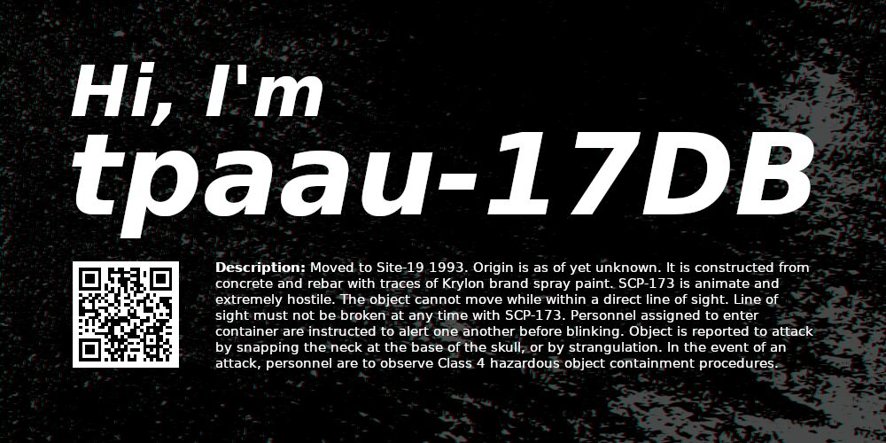

<div aligin="center">



</div>

[](https://mastodon.social/@tpaau17db)
[](https://bsky.app/profile/tpaau17db.mastodon.social.ap.brid.gy)

---

I'm ***tpaau***, a self-taught developer from **Poland**. I develop
various CLI apps and other small utilities, video games, and other GUI apps.

Apart from coding, I also do graphic design. All logos,
wallpapers and other graphical assets in my repos are made by me.

I hate when people include source identifiers or
UTM parameters in the URLs they share.

### Contact
I can communicate fluently in both English and Polish, so hit me up with
whichever language you feel more comfortable with. 
- mail: tpaau-17db@tutamail.com

<details>
<summary>Show public key...</summary>

```
-----BEGIN PGP PUBLIC KEY BLOCK-----

mQENBGhB2NwBCAC9XmaASsQefqECOVc+20JJ9aC9fm86i2jgRca4E/6b8qp/Df7n
i0Gg/GIcTkKMDwd74IJouwMcalmilODMjHb+4ynfO71SibdiKJnhSJ9dKKWx968v
y0C5giTrCtqU2Pn1m72geyi5lv16+CZGGlQ67zGbvVY0muBGgVkTpNMZyYsI6lxk
VzdTZFuZSVjeMT18ipfynxh+DH6H16GrMiHjtvQExwBc5fm64Pf3PKPi02Ug+EUa
jhC+jv1tie/AB2FMixcUWeJnAqXyLynOG/dPxazPxkIBix7ZrhDBcuvU3ygj2bK6
h5raWUGXO/XGY9+RYT3vJLlWOaNInXo/1z5tABEBAAG0Mk1pa2/FgmFqIChIZWxs
bywgd29ybGQhKSA8dHBhYXUtMTdkYkB0dXRhbWFpbC5jb20+iQFUBBMBCgA+FiEE
N3w5ZAg7LBSwf8wUT7T9uEy7iMcFAmhB2NwCGwMFCQPCZwAFCwkIBwIGFQoJCAsC
BBYCAwECHgECF4AACgkQT7T9uEy7iMemUAf9EfIyqH9BfSoJrL1Tq1/Nq4CaAMwQ
uMqIM4Y3P3Po/1C2Jf80rfIL23NFvHyMu38zOiKsKXwbpJM0hoYYcW3abGKhnCLn
jhIoLFsiZAoeKPHMiqY1AP48kLbfGWmA12gTfcHulAiwgezIXBAT8Mu1Akh+imrF
fS10PGPtkh+aKP546R0kdJ79qq2DsH25bLLLhyeS8Orj6viH4uXT0y1WVrRrLXd8
BLT49dXqrtyajfXE9Wrz1hd1CQ5bZ1iEDIpUVgFWnbHOJlTxdAo1AGMCjHEB1a4v
b5t07wfl599fiFDKvUHT/wiMC+SQmm9bV0Afx2YmEaay4mII1Ue/xmqPX7kBDQRo
QdjcAQgA4vJAYqtKrJYCBc1ggneKuKEEQ7dytD+8iEs4wcaZh8Q6z4v/ih4vqCwG
oqcPzqynGXdo/TIibnzxjAPLxsYoO1H594TW7dWIhGLEr6E9OdMLvmgjPvmbaN75
lOxi3qaTrCGZu5mUUnRaP52nYjOFASJ4eoXIVQyVzZizCgwOnIoeNc6W3z+h1eXh
yiRYKKabwDfw2iPhUmNSvYXfRC9VBicQ+o2m+CEtSRiIlztm+7qdmdetLhy5CDqE
ZLLDWcpPWxlaXmDq8CrzIMixA3+aB/2HJiP+4i8L0oKgGhhmh1u9EHNXZhdijJUr
LyqrElZUoDyIrOx+08Yp6zsM4U/R+wARAQABiQE8BBgBCgAmFiEEN3w5ZAg7LBSw
f8wUT7T9uEy7iMcFAmhB2NwCGyAFCQPCZwAACgkQT7T9uEy7iMf7cQgAslW+oS1D
7/cLFzvfa0cUEluLAXMDCI6I14He9UCFzPBC3WvJC9+tAa1mfpuKDOK8ASINLTz2
HIAAefBV/8KERcbQHDklPfO3qcgUP3v311LrEUReMZVwmVwRNleyPo0y71W+c7tH
rHpDwYTcmNX34crLQrFLHNamttOiJCN6NzFKb4L5k4b2Objxq+21uQ81DqX/530/
JKYqr2AQhf9eSZBHZddcr1cUwV22PjiTitsB6EKGggZohh0pxED/5CCLP/E+n8C6
V4vl1te7P+6AVnJ/sd+RKLUwjnNKFuYXXnIhQTgbIR5aaYVr54da3cD8ahmkHzlr
qvyGUp8V/HHFqrkBDQRoQdjcAQgAwvqW1Uwh5yDN4pUFIOrXpQqmthlCdnJIEWlC
SpWv8tpLL9bY8WmL+XJnSV52DVxYjno8uM6RL7U0waIkRjhi8SpWJU+pdj3e9oK1
hJsrEgxGQBtloSKwA05TGgg2UM4BNtymjPKN4S1a8x9kAvwxCRXQ1e9tzJagTLPd
DXnrMBbJLJ3Sc/SHDw+HfK9hLbRQx41r8RNI1K3djy7jA3M7M/mUQcHGTkdXFhkz
rtmt1La58zDoxRRxYmYuyX5hJkzJ1nMmfkTmXI0jK6N8DExPwQTVCL/tpM37/cp4
hNOaIDhxIk+f3uai4VgV+KCSF5g9Eqkupnu3ELkVRML9TnW6QQARAQABiQE8BBgB
CgAmFiEEN3w5ZAg7LBSwf8wUT7T9uEy7iMcFAmhB2NwCGwwFCQPCZwAACgkQT7T9
uEy7iMeMTQf9Hsbz5t7BIx5Ybx96RZYsPj6VQp0q4f2YfPnTCDPFEyH3ZTa57wSK
ldhewGWdC9fHXgEmpbnCg6/0zLHCKbmERIPioFY7lLpmFbkOOfSxymn5C72MyY8I
VNfZ2Ma6iY539RxARkFgLMyEixxsqDEWLMe2jQRW29CWqHUcfa/5PyX1KAWwu4N5
Nw5CrMs9ycXLP9+98xLlyp6HZ7aNPsYi/S67jrAAGD63uylCHgE33pARCBbeksVz
Q5GK+O7GHgdmKOW0LgGD+bGc5iXzaMzAX1SH7dKwgX613+Sr4b0PuAYuk6CWNCm3
WjLFKcKINFaViMh0x+C/Rl7zHU8zAjqxXw==
=7eOd
-----END PGP PUBLIC KEY BLOCK-----
```

</details>
